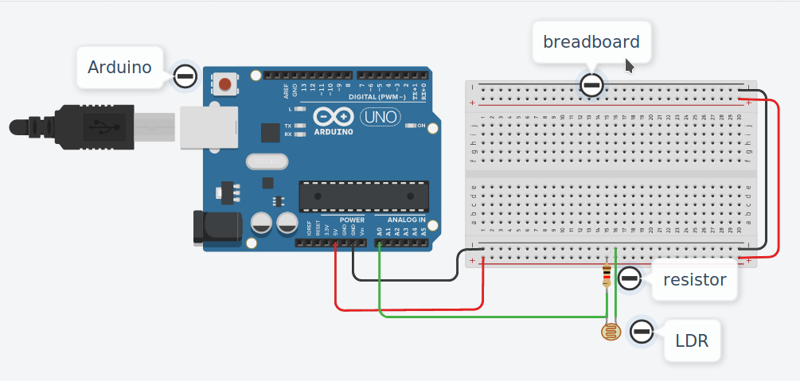

#### Light based Parking System 

**Arduino and version 1 code-** [lbps](https://github.com/overrkill/lbps)

**version 2 code-** [lbps2](https://github.com/overrkill/lbps2)

>this version focuses on react frontend for providing interface to interact with the parking 

#### Setup Instructions
- Clone arduino sketches from version one and pyduino
- setup nodejs and npm 
- confgure arduino as per the circuit diagram




#### start the client -

- clone this repository 

```
npm install
npm start
```

